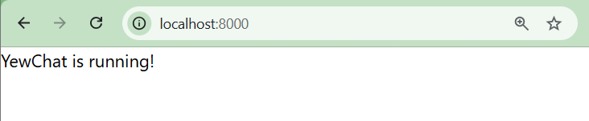

# YewChat 💬

> Source code for [Let’s Build a Websocket Chat Project With Rust and Yew 0.19 🦀](https://fsjohnny.medium.com/lets-build-a-websockets-project-with-rust-and-yew-0-19-60720367399f)

## Install

1. Install the required toolchain dependencies:
   ```npm i```

2. Follow the YewChat post!

## Branches

This repository is divided to branches that correspond to the blog post sections:

* main - The starter code.
* routing - The code at the end of the Routing section.
* components-part1 - The code at the end of the Components-Phase 1 section.
* websockets - The code at the end of the Hello Websockets! section.
* components-part2 - The code at the end of the Components-Phase 2 section.
* websockets-part2 - The code at the end of the WebSockets-Phase 2 section.

---

## Experiment 3.1 - Original code

### Screenshot


### Reflection
The Yew web client was successfully compiled and served through webpack-dev-server on localhost:8000. The application renders a simple Yew component in the browser using WebAssembly.

Several adjustments were required because the original article uses older dependencies and project configurations. The `wasm-bindgen` dependency had to be updated to support the current Rust toolchain. The startup script in `package.json` was also modified so the generated `pkg` directory would not be deleted before webpack served the application.

The application uses `yew::start_app::<App>()` because this project still uses Yew 0.19.3. Newer Yew versions use `Renderer`, but that API is not available in this version.